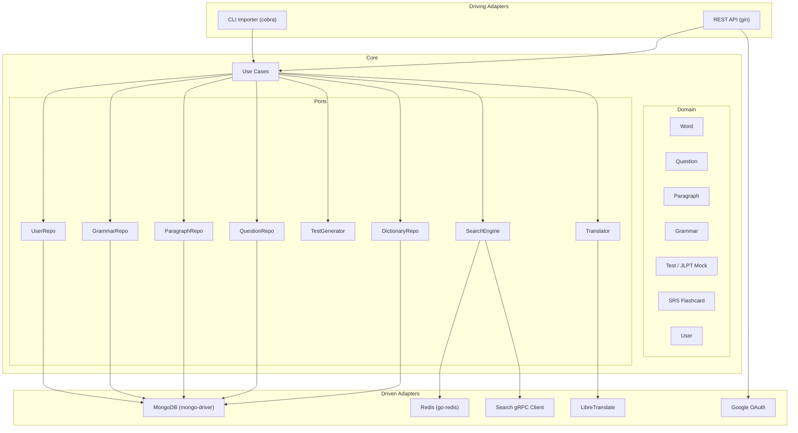

# Japanese Learning App — Go Hexagonal Architecture (v2)

## Decisions Summary

| Decision | Choice |
|----------|--------|
| Module | `github.com/Tranduy1dol/go-microservice` (rename later) |
| Database | **MongoDB** |
| Search Integration | **gRPC** (Go client now, C++ server later) |
| Dictionary Data | **JMdict** + admin custom entries |
| Content Types | **Word, Question, Paragraph, Grammar** |
| Test Generation | **JLPT N3-like** tests by shuffling content pools |
| User Auth | **Google OAuth** |
| Translation | **LibreTranslate** (free) |
| Learning | **SRS Flashcard** algorithm (SM-2) |
| Frontend | **Backend REST API only** |

---

## Architecture



---

## Project Structure

```
go-microservice/
├── cmd/
│   ├── api/main.go              # HTTP server
│   └── importer/main.go         # JMdict + custom data import CLI
├── internal/
│   ├── domain/
│   │   ├── word.go              # Word, Kanji, Reading, Sense, Gloss
│   │   ├── question.go          # Question (multiple choice, fill-blank)
│   │   ├── paragraph.go         # Reading comprehension passages
│   │   ├── grammar.go           # Grammar points (pattern, explanation, examples)
│   │   ├── test.go              # JLPT mock test (sections, scoring)
│   │   ├── user.go              # User profile, OAuth info
│   │   └── srs.go               # SM-2 spaced repetition model
│   ├── port/
│   │   ├── dictionary.go        # DictionaryRepository interface
│   │   ├── question.go          # QuestionRepository interface
│   │   ├── paragraph.go         # ParagraphRepository interface
│   │   ├── grammar.go           # GrammarRepository interface
│   │   ├── test.go              # TestGenerator interface
│   │   ├── search.go            # SearchEngine interface
│   │   ├── user.go              # UserRepository interface
│   │   └── translation.go       # Translator interface
│   ├── usecase/
│   │   ├── lookup.go            # Word/grammar lookup
│   │   ├── search.go            # Full-text search via gRPC
│   │   ├── translate.go         # LibreTranslate integration
│   │   ├── test_generator.go    # JLPT N3 test assembly (shuffle algorithm)
│   │   ├── flashcard.go         # SRS review session management
│   │   └── progress.go          # User study progress tracking
│   └── adapter/
│       ├── mongo/
│       │   ├── word_repo.go
│       │   ├── question_repo.go
│       │   ├── paragraph_repo.go
│       │   ├── grammar_repo.go
│       │   └── user_repo.go
│       ├── redis/cache.go
│       ├── searchgrpc/client.go
│       ├── translation/libretranslate.go
│       ├── auth/google_oauth.go
│       └── jmdict/parser.go      # JMdict XML → domain.Word
├── api/
│   ├── handler/
│   │   ├── word_handler.go
│   │   ├── question_handler.go
│   │   ├── paragraph_handler.go
│   │   ├── grammar_handler.go
│   │   ├── test_handler.go
│   │   ├── flashcard_handler.go
│   │   ├── translate_handler.go
│   │   ├── user_handler.go
│   │   └── admin_handler.go     # Admin CRUD for custom content
│   ├── middleware/
│   │   ├── auth.go              # Google OAuth JWT validation
│   │   ├── admin.go             # Admin role check
│   │   └── ratelimit.go
│   ├── dto/
│   └── router.go
├── proto/search/search.proto
├── config/config.go
├── docker-compose.yml
├── Makefile
└── go.mod
```

---

## Domain Models

### Word (`domain/word.go`)
```go
type Word struct {
    ID        string    `bson:"_id"`
    EntSeq    string    `bson:"ent_seq"`     // JMdict sequence number
    Kanji     []Kanji   `bson:"kanji"`
    Readings  []Reading `bson:"readings"`
    Senses    []Sense   `bson:"senses"`
    JLPT      int       `bson:"jlpt"`        // 1-5 (N1-N5)
    IsCommon  bool      `bson:"is_common"`
    Source    string    `bson:"source"`       // "jmdict" | "admin"
    CreatedBy string    `bson:"created_by"`   // admin user ID if custom
}
```

### Question (`domain/question.go`)
```go
type QuestionType string
const (
    MultipleChoice QuestionType = "multiple_choice"
    FillInBlank    QuestionType = "fill_in_blank"
    Reorder        QuestionType = "reorder"       // sentence reordering
)

type Question struct {
    ID           string       `bson:"_id"`
    Type         QuestionType `bson:"type"`
    Section      TestSection  `bson:"section"`     // vocab, grammar, reading
    JLPT         int          `bson:"jlpt"`
    Prompt       string       `bson:"prompt"`       // The question text (Japanese)
    Choices      []string     `bson:"choices"`       // For multiple choice
    CorrectIndex int          `bson:"correct_index"` // Index in Choices
    Explanation  string       `bson:"explanation"`   // Why this answer is correct
    Tags         []string     `bson:"tags"`
    Source       string       `bson:"source"`        // "admin" | "generated"
}
```

### Paragraph (`domain/paragraph.go`)
```go
type Paragraph struct {
    ID        string     `bson:"_id"`
    Title     string     `bson:"title"`
    Content   string     `bson:"content"`      // Japanese text passage
    JLPT      int        `bson:"jlpt"`
    Questions []Question `bson:"questions"`     // Reading comprehension Qs
    Tags      []string   `bson:"tags"`          // topic tags
    Source    string     `bson:"source"`
}
```

### Grammar (`domain/grammar.go`)
```go
type Grammar struct {
    ID          string   `bson:"_id"`
    Pattern     string   `bson:"pattern"`       // e.g., "〜ために"
    Meaning     string   `bson:"meaning"`        // English/Vietnamese meaning
    Formation   string   `bson:"formation"`      // How to form it
    JLPT        int      `bson:"jlpt"`
    Examples    []GrammarExample `bson:"examples"`
    Notes       string   `bson:"notes"`
    Source      string   `bson:"source"`
}

type GrammarExample struct {
    Japanese    string `bson:"japanese"`
    Reading     string `bson:"reading"`
    Translation string `bson:"translation"`
}
```

### JLPT Mock Test (`domain/test.go`)

```go
type TestSection string
const (
    SectionVocab   TestSection = "vocabulary"
    SectionGrammar TestSection = "grammar"
    SectionReading TestSection = "reading"
)

type Test struct {
    ID        string        `bson:"_id"`
    JLPT      int           `bson:"jlpt"`
    Sections  []TestPart    `bson:"sections"`
    TimeLimit time.Duration `bson:"time_limit"`  // e.g., 95min for N3
    CreatedAt time.Time     `bson:"created_at"`
}

type TestPart struct {
    Section   TestSection `bson:"section"`
    Questions []Question  `bson:"questions"`
}

// Test generator shuffles from pools:
// - Vocab section: 25 random vocab questions at JLPT level
// - Grammar section: 25 random grammar questions
// - Reading section: 3-4 random paragraphs with their questions
```

---

## JLPT N3 Test Generation Algorithm

The test generator assembles a mock JLPT N3 test by:

1. **Vocabulary section** — Query `questions` collection where `section=vocabulary, jlpt=3`, sample N random, shuffle order + shuffle choices
2. **Grammar section** — Query `questions` collection where `section=grammar, jlpt=3`, sample N random, shuffle
3. **Reading section** — Query `paragraphs` collection where `jlpt=3`, sample 3-4 random paragraphs, include their embedded questions, shuffle paragraph order

```go
// port/test.go
type TestGenerator interface {
    GenerateTest(ctx context.Context, jlptLevel int) (*domain.Test, error)
    SubmitTest(ctx context.Context, testID string, answers []Answer) (*TestResult, error)
}
```

Each generated test gets a unique ID stored in MongoDB so users can submit answers and get scored.

---

## API Endpoints

### Public
| Method | Path | Description |
|--------|------|-------------|
| GET | `/api/v1/auth/google` | Initiate Google OAuth |
| GET | `/api/v1/auth/google/callback` | OAuth callback |
| GET | `/api/v1/health` | Health check |

### Authenticated (Google OAuth JWT)
| Method | Path | Description |
|--------|------|-------------|
| GET | `/api/v1/words/:id` | Get word by ID |
| GET | `/api/v1/words/search?q=...` | Search (via gRPC to C++ engine) |
| GET | `/api/v1/words/jlpt/:level` | Browse by JLPT |
| GET | `/api/v1/grammar` | List grammar points |
| GET | `/api/v1/grammar/:id` | Get grammar detail |
| POST | `/api/v1/translate` | Translate via LibreTranslate |
| POST | `/api/v1/tests/generate` | Generate JLPT mock test |
| POST | `/api/v1/tests/:id/submit` | Submit test answers, get score |
| GET | `/api/v1/tests/:id/results` | View test results |
| GET | `/api/v1/flashcards/review` | Get due SRS cards |
| POST | `/api/v1/flashcards/answer` | Submit flashcard answer (updates SRS) |
| GET | `/api/v1/users/me/progress` | Study progress |

### Admin (role-gated)
| Method | Path | Description |
|--------|------|-------------|
| POST | `/api/v1/admin/words` | Add custom word |
| POST | `/api/v1/admin/questions` | Add question |
| POST | `/api/v1/admin/paragraphs` | Add reading paragraph |
| POST | `/api/v1/admin/grammar` | Add grammar point |
| DELETE | `/api/v1/admin/{type}/:id` | Delete any content |
| POST | `/api/v1/admin/import/jmdict` | Trigger JMdict import |

---

## Go Libraries

| Purpose | Library |
|---------|---------|
| HTTP | `gin-gonic/gin` |
| MongoDB | `go.mongodb.org/mongo-driver/v2` |
| Redis | `redis/go-redis/v9` |
| gRPC | `google.golang.org/grpc` |
| Config | `spf13/viper` |
| Logging | `uber-go/zap` |
| Validation | `go-playground/validator/v10` |
| Testing | `stretchr/testify` |
| CLI | `spf13/cobra` |
| OAuth | `golang.org/x/oauth2` + Google provider |
| JWT | `golang-jwt/jwt/v5` |
| Swagger | `swaggo/swag` + `swaggo/gin-swagger` |
| DI | `google/wire` |
| Hot Reload | `air-verse/air` |

---

## Implementation Phases

### Phase 1: Foundation
1. Restructure project to hexagonal layout
2. Domain models: Word, Question, Paragraph, Grammar, Test, User, SRS
3. MongoDB adapter with all repositories
4. JMdict XML importer CLI
5. Google OAuth authentication
6. Basic word/grammar CRUD endpoints
7. Admin endpoints for custom content

### Phase 2: Search + Test Generation
1. gRPC proto definition + Go client adapter
2. Search use case with Redis caching
3. JLPT N3 test generator (shuffle algorithm)
4. Test submission + scoring
5. Search endpoint

### Phase 3: Learning Features
1. SM-2 SRS flashcard engine
2. Flashcard review session endpoints
3. User progress tracking + statistics
4. LibreTranslate integration

### Phase 4: Polish
1. Rate limiting, CORS
2. Comprehensive tests (unit + integration)
3. Docker Compose (Go API + MongoDB + Redis + LibreTranslate)
4. Swagger documentation
5. CI/CD

---

## Docker Compose

```yaml
services:
  api:
    build: .
    ports: ["8080:8080"]
    depends_on: [mongo, redis, libretranslate]
  mongo:
    image: mongo:7
    ports: ["27017:27017"]
    volumes: [mongo_data:/data/db]
  redis:
    image: redis:7-alpine
    ports: ["6379:6379"]
  libretranslate:
    image: libretranslate/libretranslate:latest
    ports: ["5000:5000"]
    environment:
      LT_LOAD_ONLY: "en,ja,vi"
  # search-grpc: (added in Phase 2 when C++ gRPC server is ready)
```
